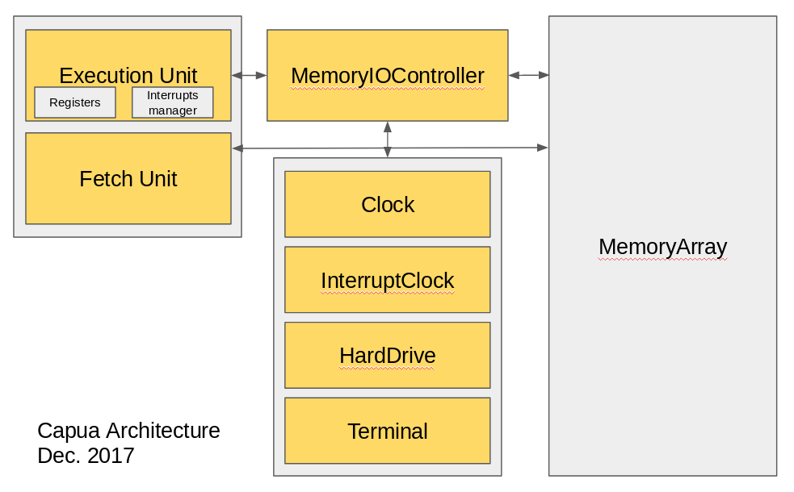


# Livre de Référence Spartacus
Version 2.0
Décembre 2017

Ce document ne répète pas les informations disponibles dans le guide de démarrage rapide.
Veuillez lire le guide de démarrage rapide avant de lire ce document.

## Historique du document
* Décembre 2018
    * Réécriture complète du document. La version actuelle de la machine virtuelle n'est pas
    compatible avec la première version. L'environnement de jeu a été retiré du projet. Plusieurs
    instructions ont été ajoutées. Certaines règles concernant la langue ont aussi été modifiés.
    
## Introduction
Capua est un coeur virtuel conçu pour aider les nouveaux venus à la programmation assembleur et
la programmation de système d'exploitation en général. Capua a été
développé après avoir constaté que les nouveaux diplômés en sciences informatique ont subit une diminution d'habiletés 
en programmation de bas niveau. Ainsi, les fonctions de Capua sont très simples afin que les utilisateurs puissent 
bénéficier de la simplicité de sa conception dans un contexte d'apprentissage.

### Note
À travers ce document, toute référence faite au "matériel informatique", sauf si spécifié, devrait être
interprétée comme "matériel virtuel".

## Capua versus Spartacus
Spartacus, c'est le projet entier. Capua, c'est l'environnement virtuel.

## Changements importants de la version 1.0 à la version 2.0
* Capua supporte maintenant les intérruptions matérielles et logicielles
* Plusieurs instructions ont été ajoutées: 
    * **ACTI, DACTI, HIRET, INT, SFSTOR, SIVR**
    * Celles-ci offrent les fonctionnalités minimalles requises pour le développement de système d'exploitation.
* Capua comporte maintenant 16 registres à usage général (GPRs):
    * Cet ajout a forcé un changement au niveau du code de machine. Un code construit
    à l'aide des anciens outils ne pourra fonctionner correctement sur Capua V. 2.0.
* Le support pour plusieurs pièces de matériel a été ajouté:
    * Disque rigide, horloge d'intérruption et Terminal.
* Les éléments matériels qui étaient fortement liés à l'environnement de jeu ont été retirés.
* L'environnement de jeu a été retiré du projet.

## Capua

Capua est une architecture de type load/store
(charger/stocker). Ainsi, seules les instructions de
chargement (**MEMR**) et de stockage (**MEMW**) peuvent
accéder à la mémoire. Les instructions relatives aux piles ont également accès à
la mémoire, mais de façon beaucoup plus restreinte.
## Registres
Capua possède maintenant 16 GPRs allant de **A** à **G**, de **A2** à **G2**, **S** et puis **S2**. Le registre S
(pour Stack) est le pointeur de pile. Tous les registres possèdent 32 bits. 
Le registre d’adresse d’instruction est nommé **I** et
n’est pas accessible aux utilisateurs. Le registre des
drapeaux est nommé **FLAGS** et n’est pas non plus
accessible aux utilisateurs.

## Mémoire
En ce moment, aucun mécanisme de gestion de la mémoire n'est disponible.
C'est un des éléments sur lesquels nous travaillons. Un tel système devrait être
disponible dans une version ultérieure.
La mémoire physique est donc accédée directement. Le début de la mémoire utilisateur
est défini à l'intérieur du fichier **Configuration/Configuration.py**. Par défault,
cette valeur est 0x40000000. Aussi par défaut, la machine virtuelle possède 1Mo de mémoire.
Ces valeurs peuvent être modifiées mais il est recommandé de conserver les valeurs par défaut.
## Dispositifs mappés en mémoire
Sur capua, l'ensemble du matériel est assigné en mémoire. Chaque élément peut être 
accédé à partir d'une addresse situé sous l'addresse de début de la mémoire (0x40000000).
La présence de ce matériel est une des raison pour lesquelles ils n'est pas recommandé 
de modifier la configuration de la mémoire.
## Architecture générale
En date de décembre 2017 l'architecture Capua ressemble à ceci:


Comme vous pouvez le voir, l'architecture est très simple mais semblable à celle d'un 
ordinateur réel.

# Liste d'instructions
La syntaxe du language assembleur Capua est organisée d'après le modèle source -> destination.
Lorsque deux éléments sont présents dans une instruction, une valeur immédiate, ou un registre, le
premier élément est toujours la source tandis que le deuxième est toujours la destination.
L'ensemble des instructions du language Capua sera maintenant présenté.
###### Régistres, valeurs immédiate et références mémoires
L'assembleur demande que le programmeur utilise le préfixe **$** devant un registre. Le préfixe
**#** doit quant à lui être utilisé devant une valeur immédiate. L'utilisation d'une étiquette
de référence mémoire est permise à l'intérieur des instructions utilisant des valeurs immédiates.
Il n'est cependant pas requis de leur donner un préfixe.
### ACTI
Cette instruction permet d'activer le mécanisme de gestion des intérruptions. Une fois l'instruction activée, 
l'instruction INT ainsi que les intérruptions matérielles
peuvent être transmises à l'unité d'exécution. La gestion des intérruptions est décrite
à la section appropriée. L'instruction ACTI n'utilise aucun registre ou valeur immédiate.
>**ACTI**
### ADD
Cette instruction permet l’addition de nombres
entiers. Les différentes utilisations de l’instruction d’addition sont présentées ci-dessous.
>**ADD #0xFF $A**

>**ADD $B $A**
### AND
L’instruction AND est utilisée pour les opérations
binaires. Il s’agit d’une comparaison binaire qui suit
la table de vérité AND normale:

* 1 and 1 = 1
* 1 and 0 = 0
* 0 and 1 = 0
* 0 and 0 = 0

Cette vérification est prolongée à toute
la longueur des éléments comparés (32 bits)
>**AND #0xFF $A**

>**AND $B $A**
### CALL
Il est indispensable de respecter les conditions
préalables relatives à cette instruction pour utiliser
CALL . Dans le cas contraire, des
problèmes surviendront (une erreur de mémoire, en
général). Avant d’utiliser cette instruction, vous
devez vous assurer que le pointeur de pile S
pointe dans une zone de la mémoire
valide et disponible. L’instruction CALL entraînera
une copie de l’adresse de l'instruction suivante (l'instruction suivant le call)
en haut de la pile de manière à ce que cette adresse soit utilisée
comme adresse de retour.
>**CALL #0x40000010**

>**CALL $A**

>**CALL testFunction**
### CMP
L’instruction de comparaison est la seule qui permet
la modification du registre FLAGS . En ce moment,
le registre FLAGS possède uniquement trois bits. Le bit
supérieur (0b100) est activé lorsque l’élément
source de la comparaison équivaut l’élément
de destination. Le bit central (0b010) est activé
lorsque la source est inférieure à la destination et le
bit le plus à droite (0b001) est activé lorsque la
source est supérieure à la destination.    
>**CMP #0xFF $A**

>**CMP $A $B**
### DACTI
L'instruction DACTI est l'inverse de l'instruction ACTI. Cette instruction
désactive le système de gestion des intérruptions.
L'instruction DACTI n'utilise aucun registre ou valeur immédiate.
>**DACTI**
### DIV
L’instruction div permet d’effectuer une division.
L’élément source sera divisé par l’élément de
destination. Le résultat de la division est placé dans
le registre A et le reste de la division est placé dans le
registre B .
>**DIV $C $B**
### HIRET
L'instruction HIRET signifie "Hardware Interrupt Return". Cette instruction
doit être utilisée comme instruction de retour par les routines de gestion d'intérruptions
matérielles. Elle ne doit pas être utilisée par les routines de gestion d'intérruptions logicelles.
Lorsque l'instruction est exécutée, le contrôle d'exécution retournera au code intérrompu tout
en s'assurant que la valeur que portait le registre FLAGS sera conservé au moment du retour.
L'instruction HIRET n'utilise aucun registre ou valeur immédiate.
>**HIRET**
### INT
L'instruction INT est utilisée afin de générer des intérruptions logicielles. Lorsque 
l'instruction est exécutée, l'unité d'exécution transfère le contrôle à la routine 
de gestion d'intérruption appropriée en se basant sur le numéros d'intérruption.
Veuillez consulter la section sur la gestion des intérruptions pour plus de détails.
Cette instruction existe en deux variantes. Elle peut utiliser une valeur immédiate ou un registre.
>**INT #4**

>**INT $A**
### JMP
L’instruction de saut permet de sauter, de manière
conditionnelle ou non, à un endroit spécifié du code en
consultant la valeur du registre FLAGS . Cette
instruction est particulière, car elle utilise un drapeau
indicateur pour permettre à l’utilisateur de choisir les
conditions dans lesquelles le saut devrait avoir lieu.
Les conditions possibles sont répertoriées ci-
dessous.

* <> Le saut est toujours effectué.
* <E> ou <Z> Le saut est effectué si 0b100 est défini (Drapeau E).
* <L> Le saut est effectué si 0b010 est défini (Drapeau L).
* <H> Le saut est effectué si 0b001 est défini (Drapeau H).

Il est possible de regrouper ces drapeaux indicateurs
pour établir des conditions complexes. Par exemple,
l’indicateur <LE> pourrait permettre au saut d’avoir
lieu si le drapeau E ou le drapeau L est activé.
Veuillez noter que la valeur immédiate ou le registre
utilisé par cette instruction doit posséder une
adresse mémoire valide pointant vers une instruction.
>**JMP <E\> #0x40000010**

>**JMP <LH\> $B**

>**JMP <\> testLoop**
### JMPR
L’instruction JMPR est identique à l’instruction JMP ,
avec une différence. La valeur
immédiate ou le registre utilisé(e) par l’instruction
JMPR présente un décalage relatif par rapport
au registre d’adresse d’instruction I où le saut doit
mener. Par exemple, si on utilise la valeur immédiate
\#0xFF , l’unité d’exécution commencera à lire les
instructions situées 0xFF octets après l’instruction
JMPR.
>**JMPR <E\> #0x10**

>**JMPR <LH\> $B**
### MEMR
L’instruction MEMR permet la lecture de la mémoire. L’instruction
MEMR utilise un indicateur de taille qui permet à
l’utilisateur de lire d’un à quatre octets de la
mémoire vers un registre. La source peut être un
registre ou une valeur immédiate, mais il doit s’agir
d’une adresse mémoire valide. L’indicateur de taille 
est défini à l’aide des caractères [ et ] .
>**MEMR \[4\] #0x40000000 $B**

>**MEMR \[4\] $A $B**
### MEMW
L’instruction MEMW permet l’écriture dans la mémoire. 
Comme l’instruction MEMR , elle utilise un indicateur de taille.
En raison de sa nature, l’instruction MEMW est
disponible en un nombre de variantes supérieur à
celui de l’instruction MEMR. La destination peut être
un registre ou une valeur immédiate, mais il doit
s’agir d’une adresse de mémoire valide.
>**MEMW \[4\] #0xFF #0x40000000**

>**MEMW \[4\] #0xFF $A**
### MOV
L’instruction MOV permet de déplacer des données
entre registres ou de charger une valeur immédiate
dans un registre. Cette instruction pourrait être
utilisée, par exemple, pour configurer le pointeur de
pile S dans une zone de la mémoire valide afin de
pouvoir utiliser la pile.
>**MOV #0x40000200 $S**

>**MOV $A $B**
### MUL
L’instruction MUL permet la multiplication d’entiers
entre deux registres. Il n’est pas possible d’utiliser
l’instruction MUL avec une valeur immédiate.
Puisque la multiplication peut résulter en nombres
supérieurs à 32 bits, le registre B contient les 32 bits
supérieurs et le registre A contient les 32 bits
inférieurs du nombre obtenu. Le nombre devrait se
lire sous la forme B:A après la multiplication.
>**MUL $A $B**
### NOP
L’instruction NOP est l’instruction de non-opération.
Elle ne fait rien. Comme Capua n’a pas besoin d’un
alignement sur quatre octets, l’instruction NOP est
habituellement inutile. Toutefois, elle peut être
utilisée pour remplir la mémoire au moment du
démarrage afin de faciliter le développement.
>**NOP**
### NOT
L’instruction NOT inversera les bits d’un registre. Par
exemple, si le registre A est égal à 0x01 avant
l’instruction NOT , il sera égal à 0xFFFFFFFE après
l’instruction NOT . L'instruction, s'utilise uniquement avec un registre.
>**NOT $A**
### OR
L’instruction OR est une opération OU binaire. Elle travaille suivant les règles
booléennes. Voici sa table de vérité:

* 1 or 1 = 1
* 0 or 1 = 1
* 1 or 0 = 1
* 0 or 0 = 0

Elle aura une incidence sur tous les bits d’un registre.
>**OR #0xFF $A**

>**OR $A $B**
### POP
L’instruction POP enlève 32 bits de la pile et réduit le
pointeur de pile de quatre octets vers l’arrière. Les
données qui étaient en haut de la pile seront
disponibles dans le registre précisé par l’instruction
POP . Pour que l’instruction POP soit utilisée de
manière sécuritaire, le pointeur de pile S doit être
réglé à une adresse de mémoire valide.
>**POP $A**
### PUSH
L’instruction PUSH ajoutera une valeur de 32 bits sur
le dessus de la pile et augmentera le pointeur de pile
S de quatre octets vers l’avant. Pour que l’instruction
PUSH soit utilisée de manière sécuritaire, le pointeur
de pile S doit pointer vers une adresse mémoire
valide avant d’utiliser l’instruction PUSH .
>**PUSH #0xFF**

>**PUSH $A**
### RET
L’instruction de retour est habituellement utilisée
pour revenir d’un appel. Elle prendra l’élément en
haut de la pile et attribuera sa valeur au pointeur
d’instruction I. Pour utiliser l’instruction RET ,
l’appelant doit s’assurer que la valeur située au haut de
la pile est un pointeur vers une région de la mémoire
pouvant être exécutée par l’unité d’exécution.
>**RET**
### SFSTOR
L'instruction SFSTOR signifie "Safe Store". L'utilisation du terme "safe" fait référence
à l'atomicité de l'instruction. L'instruction prend la valeur présente dans l'opérande
source (soit un registre ou une valeur immédiate) et copie cette valeur à l'adresse
contenue par le registre $A si la condition est respectée en effectuant une comparaison
entre l'information contenue à l'adresse mémoire et les données fournie par l'instruction.
L'instruction changera aussi la valeur du registre FLAGS en fonction du résultat de la comparaison.
L'ordre de comparaison est défini comme source (immédiate ou registre) contre l'information obtenue
à l'addresse pointée par le registre $A et non pas le contraire.
>**SFSTOR <LH\> #1**

>**SFSTOR <LH\> $B**

Cette instruction a pour objectif de permettre au programmeur d'écrire du code permettant la synchronisation
entre fils d'exécution (thread) comme des mutexes.
### SHL
La mnémonique d’instruction SHL représente un
décalage vers la gauche. L'instruction permet à
l'utilisateur de déplacer la valeur d’un registre de X bits
vers la gauche, où X est un chiffre plus grand que 0. Les
valeurs excédentaires sont simplement perdues. Par
exemple, considérons la valeur 0x80000001 . Le
déplacement vers la gauche d’un bit de cette valeur
fera en sorte que celle-ci deviendra 0x00000002
>**SHL #0x01 $A**

>**SHL $B $A**
### SHR
L’instruction SHR est la même que l’instruction SHL ,
sauf que le déplacement se produit vers la droite. Ici,
le déplacement vers la droite d’un bit de la valeur
0x80000001 produira la valeur 0x40000000.
>**SHR #0x01 $A**

>**SHR $B $A**
### SIVR
Cette instruction signifie "Set Interrupt Vector Register". Elle est utilisée pour configurer
le pointeur du vecteur d'intérruptions. Cette valeur doit pointer vers un vecteur de pointeurs
sur des routines de gestion des intérruptions. Cette instruction peut seulement être utilisée
avec un registre.
>**SIVR $A**

L'exemple de code suivant montre comment configurer l'IVR.
```
.global start:

start:
MOV end $S                      ; Stack grows up, setting S to the end is generally safer
                                ; The stack needs to be configure for interrupt handling to work
MOV vector $A
SIVR $A                         ; Set the interrupt vector to "vector"
ACTI                            ; Interrupt handling activation

loop:
    NOP
    JMP <> loop

clockHandler:                   ; All hardware interrupts are mapped to this empty handler
keyboardHandler:
hardDriveReadHandler:
hardDriveWriteHandler:
    HIRET


vector:                         ; The vector is built using the dataMemRef marker
.dataMemRef clockHandler
.dataMemRef keyboardHandler
.dataMemRef hardDriveReadHandler
.dataMemRef hardDriveWriteHandler
end:
```
### SUB
L’instruction SUB permet de soustraire des valeurs.
Il est important de comprendre que l’opération
s’effectue comme suit:
* destination = destination - source

Il est également important de savoir que
l’instruction SUB ne prend en compte que les
nombres entiers sous forme de complément de deux,
32 bits, signés.
>**SUB #0x01 $A**

>**SUB $B $A**
### XOR
L’instruction XOR est une opération binaire comme l’instruction AND et l’instruction OR. 
Elle suit la logique normale XOR (ou exclusif) selon la table de
vérité suivante :

* 1 xor 1 = 0
* 1 xor 0 = 1
* 0 xor 1 = 1
* 0 xor 0 = 0

Elle peut être utilisée pour régler la valeur d’un
registre à 0.
>**XOR #0x01 $A**

>**XOR $B $A**

# Outils
Capua, étant une architecture, demande son propre
assembleur. Pour ce project, 4 outils ont été developpés
afin de permettre le développement logiciel et la validation
de la plateforme.

* Assembler.py
* Linker.py
* Debugger.py
* HardDriverCreator.py

Cette section explique l'ensembble des outils.
Il est important de noter que ceux-ci ont, avant tout,
été développés afin de permettre de valider
le bon fonctionnement de Capua. Ainsi, les outils
présentent des "bugs" et, en tant que développeur,
vous devez vous assurer de les utiliser exactement 
de la manière décrite. Plusieurs de ces problèmes
ont été corrigés depuis la version 1.0. Une réécriture
de ces outils est planifiée.

## Compilateur
Nous n'avons présentemant aucun compilateur. C'est un des éléments majeurs
où une contribution de la communauté du logiciel libre serait plus que
bienvenue.

## Assembler.py
##### Survol
Capua possède son propre assembleur. Il est facile à utiliser et son implémentation est assez
simple.
N'oubliez pas que la version actuelle de l'assembleur a été
écrite comme outil de test pour Capua.
Veuillez respecter la syntaxe décrite ici puisque
les messages d'erreur ne sont pas toujours faciles à comprendre.
L'assembleur est très sensible aux erreurs typographique. 
Par exemple, chaque partie d'une instruction doit
être séparée par un espace blanc. Cela inclut les commentaires en fin de ligne:

>**MOV $A $B;This is not good enough**

>**MOV $A $B ;This is fine**

De toute évidence, un bon nombre de ces problèmes sont faciles
à corriger. N'hésitez pas à vous impliquer et à contribuer.

Lors de l'assemblage, le fichier d'entrée est
transformé en un fichier .o. Veuillez noter que
l'extension a été choisie en raison de la signification historique d'un fichier .o.
Capua n'utilise pas réellement le format de fichier .o. Le format de fichier utilisé par
Capua a été mis au point avec l'intention de permettre
de lier plusieurs fichiers ensemble afin de former un fichier binaire plat.
Le format actuel est également
très facile à comprendre et est un mélange de XML et de
données binaires. Ce format n'est pas parfait et sera modifié dans le futur.
Une description complète de ce format est disponible plus bas dans ce document.

##### Écriture du code assembleur
Cette partie ne se concentre pas sur le code, mais
sur les directives de l'assembleur. Ces directives doivent
être utilisées lors de l'écriture de code.

* "NomDeSymbole:"
    * Un nom arbitraire, seul, sur une ligne suivi
    d’un caractère ":" indique un symbole.
    L’assembleur l’ajoutera à la liste des
    symboles et le code sera en mesure de faire
    référence à NomDeSymbole partout où une
    valeur immédiate pourrait être utilisée. 
    Par exemple, dans le cas **MOV stackAddress $A**.
    L’adresse liée de stackAddress serait mise
    comme valeur immédiate dans l’instruction
    mov affichée. On pourrait aussi l’utiliser dans
    les boucles comme **JMP <> loopStart**
* ".global NomDeSymbole"
    * Permet à l’assembleur d’ajouter un symbole
    à la liste des symboles externes.
* ";"
    * Le caractère ";", comme dans beaucoup
    d’autres langages assembleur, indique un
    commentaire. Les commentaires peuvent être soit sur
    leur propre ligne, soit à la fin d’une ligne, à la
    suite d’une instruction. Veuillez noter que,
    dans le cas où un commentaire est mis après
    une instruction, un espace doit séparer la fin
    de l’instruction du début du commentaire (le
    caractère ";").
* ".dataAlpha"
    * On peut l’utiliser n’importe où tant qu’elle se
    trouve sur sa propre ligne. Cette directive est
    suivie par un espace blanc et un texte au
    format libre. Le texte n’a pas besoin d’être
    mis entre guillemets. En fait, il ne doit pas
    être mis entre guillemets. La chaîne de caractères se
    termine à la fin de la ligne. L’assembleur
    ajoute un caractère de fin (0x00) à la fin de la
    chaîne au moment de l’assemblage. Exemple
    d’utilisation:      
    **.dataAlpha This is a test string**
    *Notez qu'aucun commentaire ne peut suivre cette ligne.*
* ".dataMemRef"
    * Ceci est semblable à .dataNumeric, sauf 
    qu'un programmeur peut spécifier une référence en mémoire.
    Lorsque l'édition des liens est faite, la référence mémoire
    sera remplacée par son adresse.
    Cette directive est principalement utilisée afin
    de permettre la création de vecteurs d'intérruption.
    La directive est utilisée de cette manière: **.dataMemref referenceMemoire**
* ".dataNumeric"
    * C’est la même chose que .dataAlpha sauf que
    celui-ci permet au programmeur d’utiliser des
    valeurs numériques de 32 bits. Exemple
    d’utilisation :
    **.dataNumeric 0xFFFFFFFF**
* "$"
    * Utilisé comme préfixe de registre. Chaque registre,
    lorsqu’il est utilisé dans une instruction, 
    doit être précédé par le caractère
    "$".
* "#"
    * Utilisé comme préfixe de valeur immédiate. Chaque
    valeur immédiate (sauf lors de l’utilisation
    d’un symbole) doit être précédée par le
    caractère "#".
    Les valeurs immédiates peuvent être écrits de plusieurs facons :
    \#0xFF
    \#255
    \#-1
    \#0b11111111
    

##### Exemple: programme court
Voici un exemple de programme qui permet de calculer la 
longueur d'une chaîne de caractères.
```
; File Length.casm
; This will calculate the length of testString
.global start
start:
    JMP <> stackSetup   ;Jump over the string
    
testString:
.dataAlpha This is a test string

stackSetup:
    MOV stack $S        ;Stack is now usable
codeStart:
    PUSH testString
    CALL strlen
    SUB #0x4 $S         ;stack reset
end:

;Following is the length calculation
;strlen(stringPointer)
strlen:
    MOV $S $A
    SUB #0x4 $A         ;Calculate parameter offset
    MEMR [4] $A $A      ;Get parameter in register A
    MOV $A $C           ;Keep pointer to string start
lenover:
    MEMR [1] $A $B
    CMP #0x00 $B        ;are we at the end of the string?
    JMP <E> gotlen
    ADD #0x1 $A
    JMP <> lenover      ;not at the end, jump back
gotlen:
    SUB $C $A           ;A will hold the len of the string at this point.
    RET                 ;return value in register A

; Stack is at the end of the program.
; No risk of overwriting the program
stack:
```

Afin d'assembler ce fichier, vous pouvez utiliser la commande suivante:
> python3 Assembler.py -i strlen.casm -o strlen.o

Vous pouvez obtenir de l'aide au sujet de l'assembleur en utilisant l'option "-h" lorsque
vous lancez l'assembleur.

## Linker.py
##### Survol
Capua possède également son propre éditeur de
liens. Cet éditeur de liens aide à créer des fichiers binaires plats.
L’éditeur de liens peut lier plusieurs fichiers.
Étant donné que les fichiers binaires produits par
l’éditeur de liens sont destinés à être utilisés
"sur le métal" (baremetal), aucun processus d'édition de liens dynamique n’est disponible.
Toutes les adresses, suivant l'édition des liens,
sont codées en dur dans le fichier binaire résultant.
Cela signifie que l’éditeur de liens a besoin de
connaître, au moment de l’établissement de liens,
l’adresse de mémoire où le fichier binaire doit être
chargé. Si l’adresse de chargement n’est pas fournie,
le fichier binaire lié est chargé à l’adresse
MEMORY_START_AT (la valeur par défaut est
0x40000000). Cela est pratique pour effectuer des tests
puisque l’unité d’exécution commence à exécuter
les instructions à cette adresse.

##### Attention!
Lors de la liaison de plusieurs fichiers, l’ordre dans
lequel les fichiers sont donnés à l’éditeur de liens revêt une IMPORTANCE MAJEURE. Les
fichiers sont positionnés dans le fichier binaire final dans
l'ordre d’insertion dans l’éditeur de liens.

##### Note à propos des symboles
L’éditeur de liens génère un fichier ".sym" dans le
même dossier que le fichier binaire final. Ce fichier
est simplement une liste de symboles et d’adresses.
Ce fichier, s'il est disponible, est chargé lorsque vous
exécutez le fichier binaire dans le débogueur. Ceci vous
permet d’utiliser des noms de symbole à la place
d’adresse mémoire lors de l’exécution du fichier
binaire dans le contexte du débogueur. Notez que
tous les symboles présents dans le fichier ".sym" ont été
modifiés avec le nom de leur fichier d’origine
comme préfixe. Les noms de symbole eux-mêmes
sont également mis en majuscules.

##### Utilisation
Afin de procéder à l'édition des liens sur le fichier ".o" créé plus tôt, vous pouvez
utiliser la commande suivante:
> python3 Linker.py -i strlen.o -o strlen.bin

Dans l'éventualité où vous voudriez lier plusieurs fichiers ".o", le nom
de ceux-ci peut être ajouté à l'entré de l'éditeur de liens:
> python3 Linker.py -i main.o subFile.o -o main.bin

## Debugger.py
Le débogueur est l'interface du programmeur à l'intérieur de la machine virtuelle.
Lancer le débogueur, c'est lancer la machine virtuelle.
Le débogueur est simple. Il possède presque
toutes les fonctionnalités de base offertes par la
plupart des débogueurs. À l’heure actuelle, il existe
trois grandes limitations. La première est que vous
ne pouvez pas modifier la valeur d'un registre ou une
valeur de mémoire avec le débogueur. Vous ne
pouvez pas non plus « sauter par dessus » un appel
de fonction facilement. Pour cela, vous devriez
placer un point d’arrêt au retour de l’appel de
fonction. La dernière limitation est que vous ne
pouvez pas "recharger" le programme
sans relancer le débogueur. Toutes ces
caractéristiques sont notées et seront ajoutées à un
moment ultérieur. L’utilisation du
débogueur est simple et facile. Il suffit d’exécuter le
débogueur avec l’option « -h » pour apprendre les fonctions de base. 
Une fois lancé, le débogueur s’arrête avant l'exécution
de la première instruction. Vous pouvez accéder
au menu d’aide du débogueur en tapant « h » ou
« help » à l’invite du débogueur.

Afin de lancer le fichier binaire créé plus tôt, vous pouvez utiliser la commande suivante:
> python3 Debugger.py -i main.bin

##### Note importante au sujet du processus de démarrage virtuel
Si le débogueur est lancé sans aucun paramètre, il utilisera le code du "firmware" présent
dans le fichier CapuaEnvironment/firmware.bin. Pour que ceci fonctionne, le fichier CapuaEnvironment/firmware.casm
doit être assemblé et ensuite lié afin de créer le fichier binaire final. Ce fichier, lorsque chargé
tentera d'effectuer une validation du disque rigide. Si cette validation fonctionne, le
premier secteur du disque rigide sera chargé à l'addresse MEMORY_START_AT (valeur par défaut 0x40000000)
et commencera l'exécution du code nouvellement chargé. Ceci a pour objectif de simuler le
processur de démarrage d'un ordinateur. Le code source du "firmware" peut être inspecté pour
plus de détails.

## HardDriveCreator.py
C'est outil est simplement un outil d'aide visant à générer un fichier binaire
vide d'une taille acceptable pour la machine virtuelle. L'outil procédera à la validation
de la configuration de la machine virtuelle afin de créer un fichier de la bonne taille.
Par défault, un fichier de 1Mo est créé.
La machine, afin de fonctionner correctement, demmande la présence d'un fichier HD.bin à la
racine du projet. Vous pouvez générer ce fichier à l'aide de la commande:
> python3 HardDriveCreator.py -o HD.bin

L'absence du fichier HD.bin à la racine du projet causera un disfonctionnement au démarrage
de la machine virtuelle (que le "firmware" soit utilisé ou non)

# Gestion des intérruptions sur Capua

Capua permet de gérer les interruptions à partir de sources matérielles et logicielles.
Pour que les intérruptions soient traitées, la gestion des interruptions doit premièrement être activée. 
Lorsque la machine virtuelle démarre,
la gestion des interruptions est désactivée. 
On peut activer la gestion des interruptions en utilisant l'instruction suivante
> ACTI

Inversement, la gestion des interruptions peut être désactivée en utilisant l'instruction
> DACTI

Sur Capua, la gestion des interruptions se fait à l'aide du registre de 
vecteur d'interruption (IVR). L'IVR doit être configuré avec un pointeur 
vers un vecteur de pointeurs sur des routines de gestion des intérruptions. 
Chaque interruption matérielle est associée à une valeur numérique 
(les interruptions logicielles spécifient leur propre valeur).
Lorsqu'une interruption matérielle se produit, la gestion des interruptions 
est désactivée et l'exécution reprend la routine de gestion d'interruptions 
correspondant à un numéro d'interruption. Le processus est semblable pour 
les interruptions logicielles. Cependant, le traitement des interruptions n'est 
pas désactivé lors de la gestion d'une interruption logicielle. Ceci permet au système de 
recevoir les interruptions matérielles lors de la gestion d'une interruption de logiciel. 
Lors de l'interruption, la routine de gestion est sélectionnée à partir du 
vecteur d'interruption suivant cette formule:
```
IN est le numéro d'interruption
Vecteur est l'adresse du vecteur d'intéruption
Routine est l'address à laquelle l'adresse de la routine de gestion appropriée peut être trouvée

Routine = Vecteur + (IN * 4)
```

Il est d'importance majeure que le programmeur comprenne que, pendant la gestion
d'une interruption matérielle, toutes les interruptions sont désactivées sur le système. 
La plupart des périphériques sur Capua utiliseront une cache afin de conserver
les intérruptions et pouvoir les livrer plus tard. Cependant, ceci n'est pas garanti.
Certaines interruptions peuvent être perdues si l'exécution demeure
à l'intérieur d'une routine de gestion des interruptions trop longtemps. 
À la fin de la routine de gestion, dans le cas d'une interruption matérielle, 
une instruction de retour spéciale doit être utilisée:
>HIRET


L'instruction HIRET ne permet pas tout simplement d'effectuer un retour. 
Elle réactive également la gestion des interruptions sur le noyau et s'assure 
que le registre FLAGS est réinitialisé à la même valeur qu'il était avant l'arrivée
de l'intérruption. 
L'instruction HIRET ne doit pas être utilisée pour retourner des routines de gestion 
des interruptions logicielles.

Le retour d'une d'une intérrruption logicielle est faite, comme un retour de fonction, en utilisant
l'instruction "RET".
##### Configuration des intérruptions
Sur Capua, en ce moment, seuls les 4 premiers vecteurs d'interruptions sont utilisés. 
Les vecteurs 0 à 31 devraient tous être considérés comme réservés. 
Un gestionnaire d'intérruptions logicielles ne doit donc pas les utiliser. Voici la
la cartographie d'interruption actuelle:

* 0 est mappé sur INTERRUPT_CLOCK
    * L'intérruption 0 est générée par l'horloge d'intérruption à un interval configuré
* 1 est mappé sur INTERRUPT_KEYBOARD
    * L'intérruption 1 est générée par le clavier du terminal dès qu'une touche est enfoncée
* 2 est mappé sur INTERRUPT_HARD_DRIVE_DONE_READ
    * L'intérruption 2 est générée par le disque rigide quand une opération de lecture est terminée
* 3 est mappé sur INTERRUPT_HARD_DRIVE_DONE_WRITE
    * L'intérruption 3 est générée par le disque rigide quand une opération d'écriture est terminée

###### Note importante:
Il est possible qu'un programmeur ait besoin de mettre
en place un gestionnaire d'interruptions logicielles à la palce de simplement utiliser
des appels de fonction. Après tout, il n'y a pas de différence, ou presque, entre une
interruption logicielle et un appel de fonction. 
Cependant, bien que non supportés à l'heure actuelle, le support pour la mémoire virtuelle
et des niveaux de privilège multiples est présentement en cours de développement sur Capua. Il est donc
actuellement recommandé d'utiliser les fonctions d'interruption pour tout ce qui serait normalement
fourni à l'utilisateur par le noyau d'un système d'exploitation. Suivre cette recommandation
permettra d'éviter de futurs problèmes.

L'exemple de code suivant montre comment gérer les intérruptions logicielles et matérielles.
Il montre aussi comment configurer le registre IVR.

```
; This example shows how multiple hardware interrupts
; can be mapped to the same code. It also show how to
; properly handle software interrupts and setup the
; IVR
.global start:

start:
    MOV end $S                      ; Stack grows up, setting S to the end is generally safer
                                    ; The stack needs to be configured for interrupt handling to work
    MOV vector $A
    SIVR $A                         ; Set the interrupt vector to "vector"
    ACTI                            ; Interrupt handling activation
    int #4                          ; Software interrupt #4
                                    ; Since IVR is set to vector, the routine used when int #4 is executed will be
                                    ; determined by:
                                    ; routine = vector + (4 * 4)
                                    ; Since each entries are 4 bytes long
                                    ; routine = testHandler

loop:
    NOP
    JMP <> loop

clockHandler:                   ; All hardware interrupts are mapped to this empty handler
keyboardHandler:
hardDriveReadHandler:
hardDriveWriteHandler:
    HIRET

testHandler:                    ; Just a demonstrative software handler
    MOV #0xFFFFFFFF $A
    MOV #0xAAAAAAAA $B
    RET

vector:                         ; The vector is built using the dataMemRef marker
.dataMemRef clockHandler
.dataMemRef keyboardHandler
.dataMemRef hardDriveReadHandler
.dataMemRef hardDriveWriteHandler
.dataMemRef testHandler
end:
```

# Matériel mappé en mémoire
La machine virtuelle supporte le matériel mappé en mémoire. 
Le matériel mappé en mémoire est
accessible à l'aide d'adresses de mémoire spécifiques. 
La façon dont chaque élément matériel doit être utilisé est
spécifique à chaque appareil.

## Horloge (Clock)
```
Adresse de mappage: 0x20000100
Opération permise: Lecture
```
L'horloge a comme but d'offrir une source d'entropie à l'utilisateur, 
et non pour fournir l'heure à l'utilisateur. 
La lecture de 4 octets à l'adresse mappée fournira une valeur
basé sur le code python suivant:
>int((time.time() * 10000000)) & 0xFFFFFFFF

L'exemple de code suivant montre comment accéder à l'horloge:
```
MOV #0x20000100 $A
MEMR [4] $A $B          ; The clock value will be in register $B
```

## Horloge d'intérruption (Interrupt Clock)
```
Adresse de mappage: 0x20000300
Opération permise: Lecture/Écriture
```

Lors de l'écriture de 4 octets à l'adresse mappée, l'horloge d'interruption commence à générer
des interruptions matérielles à la fréquence (millisecondes) définie par la valeur de 4 octets écrite à
l'adresse de mappage. Pour que l'unité d'exécution puisse recevoir 
les interruptions générées, les interruptions doivent avoir été activées 
sur ce dernier. Aucune interruption n'est générée (même
si les interruptions sont activées) si aucune opération d'écriture n'a été effectuée 
à l'adresse mappée de l'horloge d'intérruption.

L'exemple de code suivant montre comment configurer la fréquence de l'horloge:
```
MOV #0x20000300 $A
MEMW [4] #0xFF $A       ; Will set the frequency to 255 ms
```
## Disque rigide (Hard Drive)
```
Adresse de mappage: 0x20000400
Opération permise: Lecture/Écriture
```

Un élément important doit être noté: le disque dur lui-même n'est pas 
cartographié à l'adresse de mappage. C'est le contrôleur du disque dur qui
est mappé à cette addresse.
C'est celui-ci qui est utilisé pour accéder au disque dur.

Pour pouvoir accéder au disque, une structure spécifique doit être écrite à 
l'adresse de mappage. Chaque opération faite sur le disque demande que cette
structure soit écrite de manière correcte.

Structure d'opérations d'accès au disque:

* 0x20000400 = 0x0 pour une opération de lecture ou 0x01 pour une écriture
* 0x20000404 = Le numéros LBA qui fait l'objet d'une opération (décallage de 512 octets)
* 0x20000408 = Addresse mémoire devant être utilisée pour la lecture ou l'écriture
* 0x2000040C = Déclanchement de l'action = Quand ceci est mis à 1 l'action est déclanchée.
    * Ce champ doit être remis à 0 manuellement entre chaque opération faite sur le disque.

Après une opération sur le disque, une intérruption sera généré selon l'opération.

L'exemple de code suivant montre comment lire un bloque de données à partir
du disque.
```
; This will test the correct working order of the hard drive read operation
.global start

start:
    MOV readBuffer $S
    ADD #1024 $S            ; Set the stack (needs to be set to handle interrupts
    MOV vector $A
    SIVR $A                 ; Set the Interrupt vector
    ACTI                    ; activates the interrupts
    
    MOV #0x20000400 $A
    MEMW [4] #0x0 $A        ; Set read action
    ADD #4 $A
    MEMW [4] #0x0 $A        ; Set LBA
    ADD #4 $A
    MEMW [4] readBuffer $A ; Set destination buffer
    ADD #4 $A
    MEMW [4] #0x01 $A       ; Set the trigger

waitLoop:
    NOP
    JMP <> waitLoop

clockHandler:
    HIRET
keyboardHandler:
    HIRET
hardDriveReadHandler:
    ; Do nothing in the handler, this is just an example
    HIRET

hardDriveWriteHandler:
    HIRET

vector:
.dataMemRef clockHandler
.dataMemRef keyboardHandler
.dataMemRef hardDriveReadHandler
.dataMemRef hardDriveWriteHandler

readBuffer:
end:
```

Une opération d'écriture sur le disque est très similaire à l'exception que l'opération
d'écriture doit être utilisée.
## Terminal
```
Adresse de mappage: 0x20001000 (Affichage), 0x20001800 (Clavier)
Opération permise: Lecture/Écriture
```
Le terminal est un appareil spécial car il permet l'affichage d'information (à l'écran)
ainsi que la saisie d'information à partir du clavier.
Ainsi, le terminal est, en réalité, 2 appareils en un seul.
##### Terminal - affichage
L'écran permet un affichage de 80x25 caractères. Le caractère 0 (x=0, y=0, ou celui situé
dans le coin supérieur gauche) est mappé à l'addresse 0x20001000. Le caractère
1 (x=1, y=0) est mappé à l'addresse 0x20001001. La mémoire est linéaire. Ceci
signifie que le caractère 0 de la ligne 1 (x=0, y=1) est le caractère numéro 80.
Ce caractère est donc mappé à l'adresse 0x20001000 + 80.
Afin d'être en mesure d'afficher un caractère à l'écran, le programmeur doit
écrire la valeur ascii d'un caractère à l'adresse appropriée.

L'exemple suivant montre un extrait de code qui permet d'afficher "ABCD" 
dans le coin suppérieur gauche de l'écran.
```
; This will print ABCD on the screen
.global codeStart

codeStart:
    MOV #0x20001000 $A      ; Display address
    MOV #0x41424344 $B      ; ABCD ascii code
    MEMW [4] $B $A
```
##### Terminal - clavier
Afin de fonctionner, le clavier demande que la gestion des intérruptions soit
configurée et activée. Lorsque l'utilisateur appuie sur une touche du clavier,
une intérruption de clavier est générée et le contrôle est transféré à la routine
de gestion d'intérruption du clavier. À ce moment le code de lecture (attention: code 
de lecture et non pas code ascii) pour la touche activée est disponible à la lecture
à l'adresse 0x20001800.
Dans l'éventualité où une intérruption du clavier ne peut être livrée à l'unité
d'exécution, le clavier possède une mémoire tampon pouvant contenir un maximum
de 20 codes de lecture. L'intérruption sera donc livrée à un moment ultérieur.
Dans le cas où la mémoire du clavier est pleine avant que l'intérruption soit
livrée, les codes les plus vieux seront éliminés de la mémoire du clavier.

L'exemple de code suivant montre comment lire le code de lecture d'une touche
à l'intérieur d'une routine de gestion d'intérruption pour le clavier.
```
; This will print scan code to the top left of the screen
; if a scan code does not happen to map to a printable
; character, nothing will be visible.
.global start

start:
    MOV end $S
    MOV vector $A
    SIVR $A
    ACTI

loop:
    NOP
    JMP <> loop

clockHandler:
    HIRET

keyboardHandler:
    MOV #0x20001800 $A
    MEMR [1] $A $B
    MOV #0x20001000 $A
    MEMW [1] $B $A
    HIRET

vector:
.dataMemRef clockHandler
.dataMemRef keyboardHandler
end:
```
## Format de fichier ".o" de Capua
Le format de fichier Capua est très simple. Pour des raisons évidents,
des "bugs" sont associés au format lui-même. Ces problèmes seront résolus
lorsque le format de fichier sera remplacé. Pour l'instant, le format
fonctionne correctement dans la majorité des cas.

Voici la forme générale:

```
<AssemblySize></AssemblySize>
<ExternalSymbols>
    <refName></refName>
    <refAdd></refAdd>
    ...
</ExternalSymbols>
<InternalSymbols>
    <refName></refName>
    <refAdd></refAdd>
    ...
</InternalSymbols>
<Text>...</Text>
</code>
```

Le texte qui suit explique le détail de tous les éléments
faisant parti du format de fichier.

* AssemblySize
    * Cette balise contient la taille prévue de la version
    finale liée de ce fichier. La taille est encodée en
    format "big endian" à
    l’intérieur de la balise. Le calcul de taille a été
    intégré à l’assembleur puisqu’il était plus facile
    et plus rapide de le placer à cet endroit. De plus, l’information
    est accessible à l’éditeur de liens
    lorsque celui-ci doit calculer l’adresse à l’échelle du
    fichier parmi plusieurs fichiers qui doivent être
    reliés.
* ExternalSymbols
    * Cette balise contient une liste de balises (couples
    refName/refAdd). Les symboles présents dans la
    liste ExternalSymbols sont considérés comme
    "globaux" et, par conséquent, sont à la disposition
    de l’éditeur de liens lorsque celui-ci relie plusieurs
    fichiers.
* InternalSymbols
    * Cette balise est la même que ExternalSymbols sauf
    que les symboles énumérés dans cette balise ne
    sont pas accessibles à l’éditeur de lien au moment
    de lier plusieurs fichiers. Ceci a
    comme but de prévenir les problèmes de collision de
    noms à l’échelle globale (externe) au moment de
    la liaison.
* refName
    * Une balise refName doit se trouver à l’intérieur
    d’une balise ExternalSymbols ou d’une balise
    InternalSymbols. Elle doit également être suivie
    d’une balise refAdd. La balise refName contient
    simplement la version texte du nom de symbole.
    Le nom de symbole est déterminé par la
    référence/appellation de la mémoire dans le code
    assembleur écrit par le programmeur.
* refAdd
    * Cette balise suit une balise refName et indique
    simplement le décalage où le symbole se
    trouve à partir de l’adresse 0 (par rapport au début
    du fichier). Notez que le décalage est relatif à un
    fichier entièrement relié, et non à un fichier objet (.o).
    Cette adresse remplace éventuellement le nom de
    symbole lorsque le fichier est relié.
* Text
    * La balise Text contient le fichier binaire
    assemblé du fichier objet. Un examen attentif
    révélera la présence de noms de symboles à
    l’intérieur de la balise de texte. Ceux-ci sont
    remplacés au moment de l'édition des liens. Les symboles
    sont présents dans la section de texte, sous la forme :
    ":SymbolName:". Il ne s’agit pas d’une solution
    parfaite (ni même d’une bonne solution), mais elle
    est rapide. (Gardez toujours à l’esprit qu’à l’origine,
    ces outils ont été écrits pour tester l’unité
    d’exécution, non pas pour être utilisés par des programmeurs).

- - -
This file is part of Spartacus project
Copyright (C) 2017  CSE

This program is free software; you can redistribute it and/or modify
it under the terms of the GNU General Public License as published by
the Free Software Foundation; either version 2 of the License, or
(at your option) any later version.

This program is distributed in the hope that it will be useful,
but WITHOUT ANY WARRANTY; without even the implied warranty of
MERCHANTABILITY or FITNESS FOR A PARTICULAR PURPOSE.  See the
GNU General Public License for more details.

You should have received a copy of the GNU General Public License along
with this program; if not, write to the Free Software Foundation, Inc.,
51 Franklin Street, Fifth Floor, Boston, MA 02110-1301 USA.


